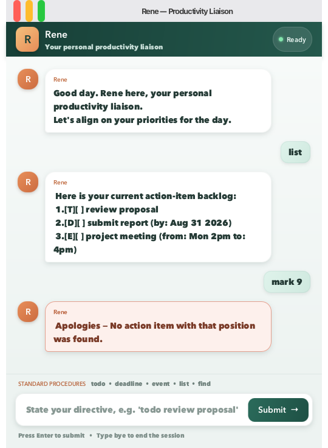

# Rene User Guide

**Rene** is a personal task chatbot with a no-nonsense, corporate register. It
keeps your todos, deadlines, and events in `data/rene.txt` so they remain
available the next time the application starts.



## Getting started

1. Download the latest `rene.jar` from the [releases page](https://github.com/Soch-ia/ip/releases) (a Java 25 installation is required).
2. Run `java -jar rene.jar` from a terminal. Rene opens the GUI and creates `data/rene.txt` in the current folder on first save.
3. Type a command (for example `todo review proposal`) and press Enter. Type `bye` or close the window to exit.

## Command summary

Enter `help` to see the command reference inside Rene:

```text
 Per your request, here is the standard operating procedure for working with Rene:
 todo DESCRIPTION
 deadline DESCRIPTION /by yyyy-MM-dd
 event DESCRIPTION /from START /to END
 list
 mark NUMBER
 unmark NUMBER
 delete NUMBER
 find KEYWORD
 help
 bye
```

## Managing tasks

| Purpose | Command | Example |
| --- | --- | --- |
| Add a todo | `todo DESCRIPTION` | `todo read chapter 3` |
| Add a deadline | `deadline DESCRIPTION /by yyyy-MM-dd` | `deadline submit report /by 2026-09-30` |
| Add an event | `event DESCRIPTION /from START /to END` | `event study group /from 2pm /to 4pm` |
| Show all tasks | `list` | `list` |
| Mark a task done | `mark NUMBER` | `mark 1` |
| Mark a task not done | `unmark NUMBER` | `unmark 1` |
| Remove a task | `delete NUMBER` | `delete 1` |
| Find tasks by description | `find KEYWORD` | `find report` |
| Show command help | `help` | `help` |
| Exit Rene | `bye` | `bye` |

Task numbers are the one-based positions shown by `list`. Deadline dates use
the ISO `yyyy-MM-dd` format. Searches ignore letter case and match task
descriptions only.

## Error handling

Rene copes with the mistakes people actually make:

- Commands tolerate leading/trailing spaces, and extra spaces inside a task
  description are collapsed. A blank line simply asks you to enter a command.
- A marker given more than once (`/by`, `/from`, `/to`) or in the wrong order
  is rejected with an explanation.
- In the GUI, error replies are shown in a highlighted card so a wrong command
  stands out from a normal reply.
- If the data file cannot be read or written (permissions, or a folder where
  the file is expected), Rene tells you what happened and continues with an
  empty list instead of crashing.

## Troubleshooting

- **The data file is missing.** Nothing to do: Rene creates `data/rene.txt`
  automatically the first time it saves.
- **The data file looks corrupted.** Rene reports which line it could not
  understand and continues with the tasks it could read.
- **JavaFX error when running the JAR on some systems.** Make sure the JAR is
  run with `java -jar rene.jar` from a terminal, on a Java 25 installation.
